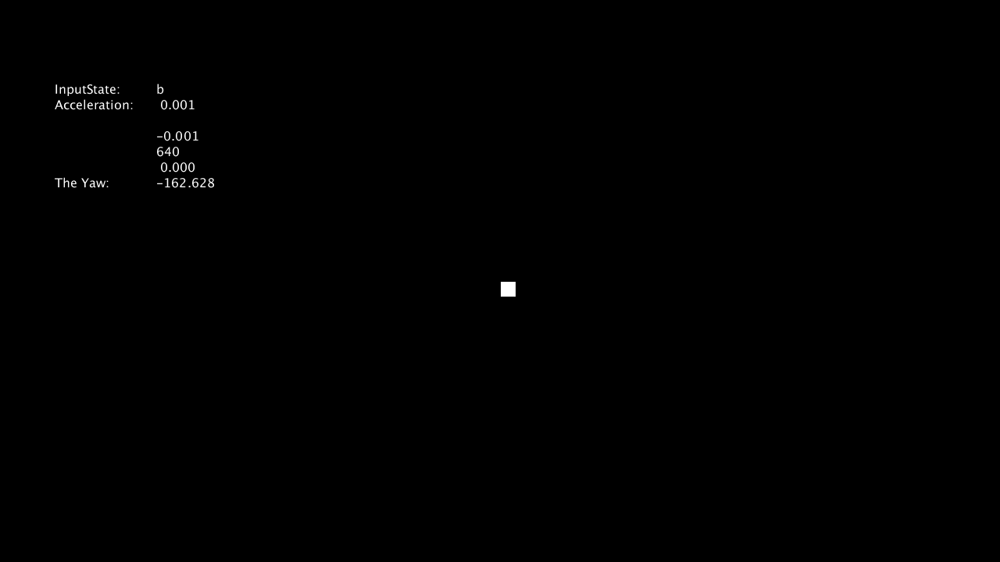

# TEAM6 BIG EATER - M5 Stack and Serial Communication

### **Content**
 * [Structure](#structure)
 * [M5 Stack - senors](#senors)
 * [M5 Stack - Serial Communication](#M5communication)
 * [Processing - Serial Communication](#ProcessingCommunication)
 * [Character Control](#control)
 * [Problems & limitations](#limitations)

## Developer
Shunyi Zhao (vt19049)

## <span id="structure">Folder Structure

The M5_stack folder are following the structure below:
```
M5_Stack
    |    README.md
    |    piecd.mp4
    └─── images (Storing images used in M5 README.md)
         |    image_1.png
         |    image_2.png
         |    image_3.png
         ...
    └─── communication (commnunication files of processing)
         |    communication.pde (communication functions and process)
         |    Character.pde (set a rectangle to represent characters)
         |    EllipseClass.pde (storing properties of a ellipse)
         |    Entity.pde (basic class)
         |    RectClass.pde (storing properties of a rectangle)
         |    ShapeClass.pde (basic class of shapes)
         |    simpleMat.pde (represent a simple mat)
    └─── sensor_1 (communication files of Ardunio)
         |    sensor_1.imo (programme written into M5 Stack)
    └─── Blender (control character in Processing Programme using M5 Stack)
         └─── BigEater (First version of combining the M5 Stack with Desktop Application)
         └─── Untested (Second version of combining the M5 Satck with Desktop Application)

```

## <span id="senort">M5 Stack - senors

The Ardunio API webpage of M5 Stack:

[M5 Stack Ardunio API](https://docs.m5stack.com/#/en/arduino/arduino_api)

We used API functions of IMU(Sensor MPU9250) to get the accelerations and Euler Angels. These parameters are organised in a string, with spaces between them. At the end of this string, a character is set to send a button signal. 

### API used in this project

M5.IMU.getAccelData(&accX, &accY, &accZ);

Get accelerations from the sensor.

M5.IMU.getAhrsData(&angle_1, &angle_2, &angle_3);

Get Eular Angles from the sensor.

## <span id="M5communication">M5 Stack - Serial Communication

A simple function called Serial.print() is used to send the string.
The format of this string is shown below:


In this string, the letter 'b' represents the button of the Stack. If the first button is pressed, this letter will be changed to 'a',
shown below:


At the end of this string, a letter 'q' is sent to represent the end of this string.

In the middle of this string, six numbers represent 3 posture angles and 3 accelerations are split by space characters, which are placed 
to distinguish these numbers.

In these two images, a problem which will be described detailed in the section [Problems and Limitations](#limitations)

These string will be sent to the USB buffer.

## <span id="ProcessingCommunication">Processing - Serial Communication

We use a function Class Serial.readStringUntil() to listen to the string sent by M5 Stack. In the above string, the letter 'q' is the symbol of the end of one command.

In the first one hundred loop getting loops, perhaps the connection between the Stack and Desktop Application has not been built, so the processing program will wait to this connection, and print "loop" to the command line. After getting this string, the processing program will divide it to 6 substrings, and the letter 'q' will be removed from this string.

## <span id="control">Processing - Character Control

Due to an unknown problem, the yaw of this sensor increases automatically. Although we have completed a series of simple version codes of matrix computation, we can not use them to calculate the true acceleration of the movements. So we used accelerations caused by angles and gravity to control the character in processing.

We use a rectangle to simulate the character, and a circle is used to represent the pointer.

The initial Interface of this communication program is shown below:


If the user slope Stack to left, the rectangle will move to left side:


When user press the first button on the Stack, the programme will check the state of the rectangle which represent the character, 
The defenifion of character states is
> 0, the rectangle move
> 1, the circle move

The programme will switch between this two states. In state1, the rectangle will not move, and the circle can move four directions.


### Methods used in this part

#### communication.ped

##### ArrayList<ArrayList<Float>> calPitchMat(float[] datas)
This method could calculate the Pitch transformation matrix. The first argument of this method is a array which contains eular angles.

The transformation matrix is organised into a two-dimension ArrayList object.

##### ArrayList<ArrayList<Float>> calRollMat(float[] datas)
This method could calculate the Roll transformation matrix. The argument is same with calPitchMat()

##### simpleMat getGravityMat()
This method could generate a gravity matrix, which is (0, 0, 1).

##### void convertCoorSystem()
The function of this method is to convert a gravity vector from the grand coordinate to the object coordinate.

#### simpleMat

##### simpleMat calMatProduct(simpleMat inputMat)
This method could calculate the result of product between two matrices. 

The result of product is organised into a simpleMat object.

##### void printDatas()
This method could print the data stored in a simpleMat object.


### Space Coordinate transformation
The main works of coordinate transformation are placed in the file called [communication.pde](./communication/communication.pde) and [simpleMat.pde](./communication/simpleMat.pde)

We planned to use the posture angles to transform the accelerations to ground coordinate system. 

The rotation and translation matrix is shown below:


Cite from wikepedia - [wikepedia matrix](https://en.wikipedia.org/wiki/Rotation_matrix)

In these two files above, some functions are used to transfrom the coordinate.

### Combining M5 Stack with Desktop Application
The video below shows the game which combine the Desktop Application and M5 Stack.
[The link to video](./piece.mp4)

## <span id="limitations">Problems and Limitations
One of the angle increase or decrease itself, shown in images below (The M5 Stack are put on the desk):




After about 10 seconds, it changed from about -163 to -172, lebeled with title "The Yaw" in these two pictures.

We thought some errors of lead to this problem. Thus, we gave up this transformation. But the codes were remained in files.

### Limitations
1. Sometimes, the serial communication would slow the processing application.
2. The communication would accumulate at the buffer of serial ports, and it would lead to the delay of controlling.
3. A rectangle is placed on the screen of Stack to show the posture of Stack, but this rectangle twinkle at the edge of screen sometimes, which makes the user difficult to see it.