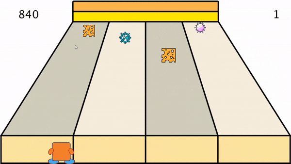
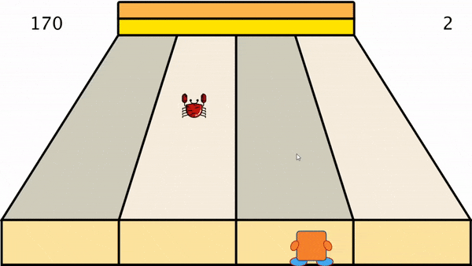
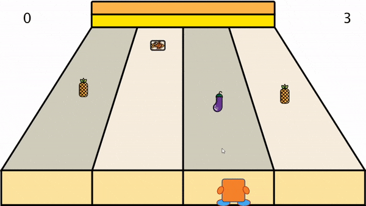
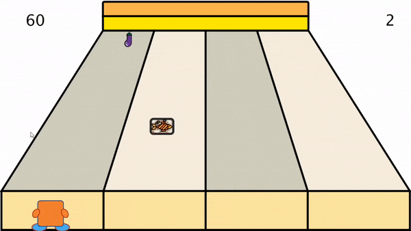
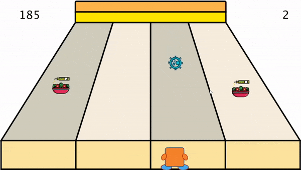
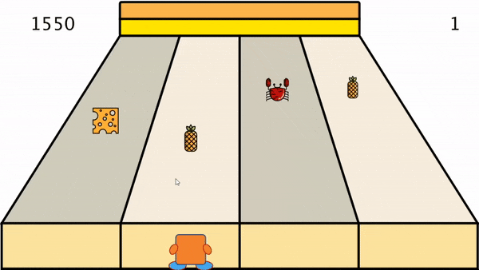
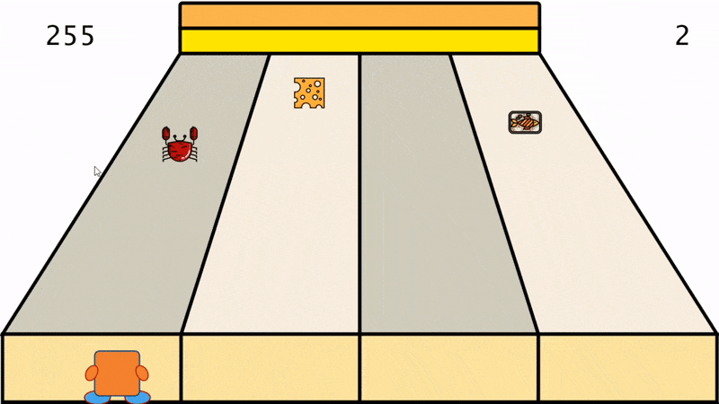
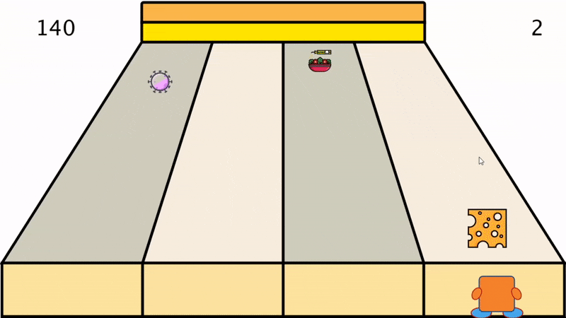
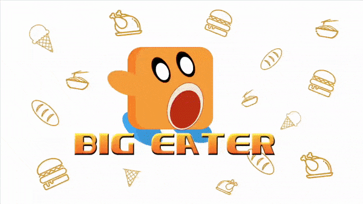

# Desktop Application - Processing

## *Content*
 * [Game Rules](#rules)
 * [Code Structure](#structure)
 * [Main Methods](#methods)
 * [Connection Test](#connection)
 * [Main Problem & Solution](#solutions)
 * [Limitations](#limitations)

Processing in Java is used as the main development tool in our BigEater game, having implemented:  
- UI Drawing
- Character Movement
- Random Food Dropping
- Random Gift Appearance
- Data Statistics
- Data Communication with Web Application

This folder consists of two versions of the BigEater game, where names of sub-folders have shown the type of game controller. In the mouse-controlled version, the left-top corner of the screen becomes the original point. Moves of the character are computed by positions of the mouse. It is normally an easier version of the game because of the flexibility and familiarity to use the mouse. Introduction of the M5Stack-controlled version can be seen at [M5_Stack_Control_Instruction](../M5_Stack/README.md). It is considered as an advanced version by game developers. We highly recommend users to get familiar with the game logic through the former one. 


## Developers
**@ Yuxuan Qiu (ug19091)**  
**@ Ben Jin (tk19028)**  
**@ Rao Hu (ya19173)**  

## <span id="rules">Game Rules
Each player will get three hearts at the beginning. Every time he/she misses one kind of food or touches one kind of virus will make the number of hearts subtracted by one. The game will be over when the number of hearts reaches to zero.  

Here are instructions of the game in different cases and each has one example:
- A piece of cheese values 10 points. (840 -> 850)  



- A crab values 15 points. (170 -> 185)



- An eggplant values 20 points. (0 -> 20)



- A fish values 30 points. (60 -> 90)



- A salad values 35 points. (185 -> 220)



- A pineapple values 40 points. (1550 -> 1590)



- Combo bonus: At the beginning of the BigEater game, a special food combination will be chosen as a combo of the current game. The player who achieves that combo can get 500 points. The number of food that makes up a combo is normally greater than 3. To simplify explanations, the combo in the following example only consists of a crab and a piece of cheese. (255 -> eat a crab -> 270 -> eat a piece of cheese -> combo achieved -> 770)



- Gift bonus: A special gift appears only when the current score can be divided by 150. The player who touches the gift can be awarded with 200 points and 2 hearts. Note that the gift will disappear when the player gets his/her next food. (150 points -> 350 points, 2 hearts -> 4 hearts)



Here is an example of the whole process of the BigEater game in double speed. It might take a bit longer time than expected because of the developer's excellent game skills.




## <span id="structure">Code Structure
This section mainly focus on the implementation of the BigEater game. Codes that realise the work of communicating with M5-Stack will be ignored. For more details of how M5-Stack works, please refer to  [M5_Stack_Control_Instruction](../M5_Stack/README.md).

All used classes of the game are following the structure below:
```
BigEater.pde
    |
    └─── Adapter.pde (Communication)
    |    Background.pde (UI drawing)
    |    Eater.pde (Character drawing)
    |    PlayerData.pde (Data statistics)
    |    Gift.pde (Gift appearance)
    |    Drop.pde (Parent class for all dropping items)
    |       |
    |       └─── Cheese.pde
    |            Crab.pde
    |            Eggplant.pde
    |            Fish.pde
    |            Pineapple.pde
    |            Salad.pde
    |            Bomb.pde
    |            Virus.pde
    |            VirusB.pde

```

BigEater class is the main entrance of the game, implementing instantiation work of all classes and more importantly, taking the work of initialising MQTT client. Adapter class processes every possible situation that may happen during the communication with web applications. Background and Eater class ensure that the game UI and characters can be painted in every frame. PlayerData class does statistics work along with the process of the game. Drop class is a superclass where all dropping item classes will inherit from it, reducing the repetition rate of codes.

## <span id="methods">Main Methods

### BigEater.pde
- **setup() :** The setup() method will only run once during the whole process and the main work of this method is to instantiate classes by constructors. Most importantly, the connection with HiveMQ will be created in this method with the following code:
```
    client = new MQTTClient(this, adapter);
    String clientName = "group_big_eater" + random(0, 99999);
    client.connect("mqtt://broker.mqttdashboard.com", clientName);
```

- **draw() :** Processing has already created a method that will run infinitely during the time of program running. By simply implementing the interface can the screen keep still until a key-pressed interrupt. In this case, the number of statuses is three. 
```
    Status 0 : Preparing for the game
    Status 1 : Running the game
    Status 2 : Analysing user preferences and stopping the game 
```

- **createNewClassRandomly() :** The number of different dropping items is eight, including six kinds of food and two kinds of viruses. The possibility of the appearance of each class is subject to uniform distribution and continuously creating random integer from zero to seven ensures the realisation of the possibility distribution.

- **setGameStatus() :** This is the core method of the whole game. Running this method once will display one frame of the program. The method has two main functions: Firstly, ensuring no new food/virus will be created during the time when the track is used. We set a Boolean array to finish this work. Once the start frame of an item is clear, with an unchanged dropping speed, the last frame that holds items will be accordingly determined. The flag of this track will remain true between these two frames. Secondly, creating an interval of items on the same track. This function will be realised by:
```
    startCount[i] = lastCount[i] + (int) random(300);
``` 

### Adapter.pde
- **clientConnected() :** This method ensures that the client instantiated by BigEater.pde is subscribing the correct topic:
```
    client.subscribe("/BigEater");
``` 

- **messageReceived() :** This method runs automatically when a new message is published to the specified topic. After getting the required message with a conventional format, the string will be parsed and a public array list will be set with food combo chosen by the player. This combo will affect the scoring mechanism of the game.

### Drop.pde
- **getDifferential() :** The aim of this method is to compute the distance of dropping items between adjacent frames. In addition, to master the rule that is everything looks small in the distance, and big on the contrary, the differential of the size of the image is also calculated:
```
    float x = (startX - endX) / speed;
    dx = (currentTrack == 0 || currentTrack == 1) ? x : x * (-1);
    dy = (endY - startY) / speed;
    dsize = (endSize - startSize) * 15 / speed;
``` 


- **display() :** This method provides a condition to compute if a class inherited from Drop.pde reaches the end of its life:
```
    (frameCount - startFrameCount) % (speed + 1) == speed
```

### Eater.pde
- **drawHands() :** This method provides a good opportunity to understand the usage of the translate() method in Java canvas. To avoid the effect caused by the changes of the original point, pushMatrix() and popMatrix() is used to preserve the current coordinate system.
```
    pushMatrix();
    translate(leftCenterX, leftCenterY);
    rotate(radians(-61.8));
    ellipse(0, 0, handLength, handWidth);
    popMatrix();
```

## <span id="connection">Connection Test

The connection test consists of two tests with different directions of data flow. The first group of data to be transferred looks like this:
```
{
    "datatype":"checkbox",
    "main":["Pineapple","Crab","Salad"]
}
```
This message is supposed to be transferred from web application to desktop application by MQTT protocol. The sign of successful acceptance looks like this:
```
new message: /BigEater - {"datatype":"checkbox","main":["Pineapple","Crab","Salad"]}
```

User preference result needs to be sent to the web application to finish the visualisation work. A standard format will look like follows:
```
{
    "datatype":"chart",
    "main":{
        "score":14,
        "bonus":0,
        "combo":1,
        "salad":0,
        "pineapple":2,
        "fish":0,
        "virus":1,
        "crab":1,
        "eggplant":1,
        "cheese", 1
    }
}
```
If the message has been successfully delivered to HiveMQ, the program should print this message:
```
new message: /BigEater - {"datatype":"chart","main":{"score":14,"bonus":0,"combo":1,"salad":0,"pineapple":2,"fish":0,"virus":1,"crab":1,"eggplant":1,"cheese", 1}}
```


## <span id="solutions">Main Problem & Solution

**Q: Size of the image won't increase when it falls.**  
A: The problem is caused by the floating rule of Processing. In this case, only one decimal will be retained. So, if we aim to pursue to reflect subtle changes in the size of the picture, the rate of change will remain zero because program automatically truncates the decimals.  

**Q: Runtime Exception is thrown when connecting to HiveMQ.**  
A: The exception is thrown because of the loss of valid reference caused by re-initialising and reconnecting to MQTT client within the publishMessage() method. The solution is to move the initialisation routines to the global scope so that the MQTT client is persistent. 

**Q: Functions of the project are unclear because of the lack of face-to-face talk.**  
A: Due to the pandemic of COVID-19, we lost opportunities of joining formal workshops, causing the uncertainty on the structures and functions of the whole group work. The solution is to increase the frequency of online meeting via Skype-for-Business.  

## <span id="limitations">Limitations

**1. Code Quality**  
There is still a lot of room for improving code quality. Because of the particularity of Processing, convenience lives with troubles. The draw() method is not friendly for variable passing, causing a large number of tricky issues. We have to use flags in Boolean type to mitigate the effect brought by repeatedly calling the same method, which reduces the readability and dryness of the code.

**2. System Design**  
The design of code structure can be further optimised. In current program, the computer needs to do a lot of calculations at the same time in one frame. Therefore, situations of delay and crash occur at a medium frequency. By making good use of the infinite draw() method, more work can be parallel done.

**3. Communication**  
In the current stage, communication with other applications stays at a low level. String is not an effective data structure to transfer information. Serialisation may become a better message carrier, for the higher capacity ability brought by its unique encoding method. A real-time system is also an option for improvement, where the message received from MQTT client can be processed immediately and affect the game in progress. It will increase the complexity of the game system and bring a better gaming experience for players. 


<!-- 1. Codes in this file are meant to load game pages and to realize game rules. Loaded game pages include loading page and ending page, background page and objects moving pages when user playing, the main character, foods(current foods include cheese, crab, eggplant, fish, pineapple, and salad), some fitness equipment, bomb, and virus.
2. Game rules include how the foods, bombs, and viruses move from top to bottom, how the main character moves from left to right and vice verse in the bottom of the page and how he eats foods to get scores, however, if the main character touches the bombs or viruses accidentally then he will lose one life(he has 10 lives in total).
3. Later, we will add more functions, for example, the main character can get gift boxes to get a bonus, and he can get a higher score if he eats food according to the provided food set. Stay tuned for updates. -->