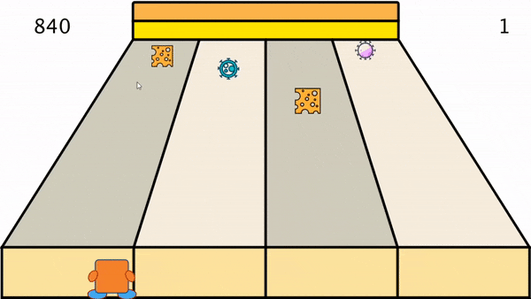
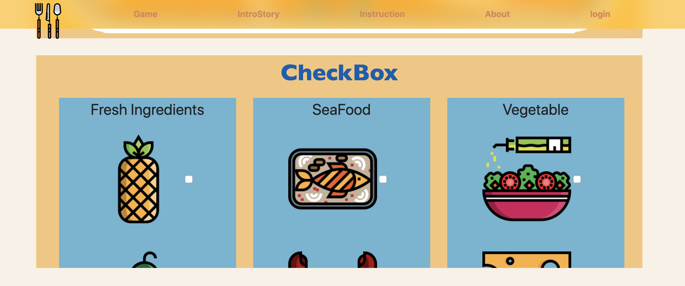

# TEAM6 -- BIG EATTER


## Members
Kehan Du (mz19460)

Rao Hu (ya19173)

HoCheung Lee (ja19025)

Ben Jin (tk19028)

Yuxuan Qiu (ug19091)

Shunyi Zhao (vt19049)

## **Content**
 * [Introduction](#Intro)
 * [System Design](#LinkToPart1)
 * [System Implementation](#LinkToPart2)
 * [Project Evaluation](#LinkToPart3)

## <span id="Intro">Introduction
Today, there are more than 2.5 billion gamers across the world and it is calculated that they spend around 152.1 billion 
dollars on games in 2019, and the revenue of game industry is expected to be worth over 270 billion dollars by 2020. Moreover,
data analysts predict that game industry will still experience constant growth in the upcoming years.

Coincidently, all of our group members are interested in computer games and software project gives us the chance to
implement our ideas to practice. As one of the most primary entertainment mediums with huge growth potential, we therefore
designed a multi-functional gaming BIGEATER which is aimed for gamers, game analysts and interactive players. We figured out a
new mode of gaming and hope it could be attractive for gamers and become successful in gaming industry.

First of all, BIGEATER is a simple and small game. The reason is that with fast pace and heavy pressure, gaming is a
wonderful way to relax. Hence, we came up with the idea to design a simple and small game which does not require gamers to spend 
a lot of time to learn and does not require the subtle skills to play, neither. In addition, we believe simple games would be 
appealing to some potential gamers and therefore expand the audience.

Secondly, BIGEATER provides processed game-related data such as game duration and game hits for game analysts, so that they 
can make decisions to optimize or promote the games. We think continuous improvement and innovation are the most significant 
factors to maintain high competitiveness of a game. Especially as a simple game, gamers may feel bored with our games easily, 
it is therefore more important for our own game analysts to make accurate and instant decisions to perfection the flaws. 
Also, other game analysts could use our software to know about the trend of popular games and help to promote the development of
game industry.

Interactive players are the third user of BIGEATER. They can be regarded as companions of gamers. Before the game begins, 
interactive players can operate in the web and make a recipe for gamers. Gamers can gain bonus marks if they combo the food in 
the recipe. At the beginning, we supposed to make a live game broadcast so that interactive players can watch the game as well as
interact in the game. Unfortunately, we cannot realize the live broadcast function, so the interactive player’s role is 
limited now. We believe it can become a good game for parents to educate children to have a good diet habit.


## <span id="LinkToPart1">System Design

In the beginning, we are supposed to design a body sensing version of FRUIT NINJA. Gamers would hold M5 stack as a knife to cut fruits in the game.The paper prototype and processing prototype is in the folder with path ./example/example_1


If the start button is clicked, a game will be started. And if the ? button is clicked, an instruction will be shown. The whole process of this version prototype is shown [here](./example/example_1/README.md)

Then, we found that maybe this game is improper as it is not our own idea and therefore, we brought the idea to build a   
really open game platform. Any game developers can register the accounts on our platform and are freely allowed to upload 
their games and gamers can choose any games to play. And maybe make a combination of a live broadcast function which has become quite popular in recent years.

However, through rounds of discussion and with the problems we met in the designing process, we found that it is too 
difficult for us to realize such a platform. Hence, we went back to our original idea and designed a game BIGEATER.
There are four conveyor belts for food. The character stands at the bottom of the conveyor belt and can only move left or 
right which is controlled by M5 stack. What’s more, there would be bonus gifts showed beyond the conveyor belts randomly, 
gamer can get bonus point if he/she use the mouse pointer to point to the bonus gift. The character will lose one health point if the character touches the bomb / virus and the game will end if the character’s health exhausted.

The paper prototype of this version is shown as below:


The whole process of this version prototype is shown [here](./example/example_2/README.md)

The structure of first version of our project is shown as below *fig.1*:


In this image, a player could use the M5 Stack to simulate a pointer in desktop application. The fruits are dropped from the top of the screen, player could use this pointer cut fruits and obtain scores. A manager could see the data collected by desktop application, and change the type of food, or other properties of food and game. An audience could watch the process of gaming, and chat with player and other audiences.

The structure of second version of our project is shown as update *fig.2*:


In this image, a player could control the character in Desktop Application with a M5 Stack or a mouse. When the character touch the foods, the score will increase. They also could use the pointer to touch the gift, which will add their health or score. A manager could see the data collected by application, including the player's prefence, if he/she logs in with an administrator account. The interactive player could choose combo in the website.

---

### User Stories

Gamers (player in fig 2): have fun and gain diet knowledge at the same time Gamers would use the web to start the game and hold M5 Stack to choose the settings and control the character in the game. They can choose level of difficulty and view instructions as well. When game starts, gamers can slope the M5 Stack to control the movement of character. If the bonus gift appears, player can get bonus point by using the mouse pointer to point to the bonus gift. As a game, we intend to help gamers have some fun and hopefully release from pressure. Besides, gamers would get bonus marks if they follow our recipe’s ingredients, so that they can gain some diet knowledge during the game. We hope that gamers can be affected unconsciously and eat healthy.

Interactive Players: company the gamer and gain diet knowledge. Interactive players would use the web to make recipe for the gamers and our game would provide nutrition information of food and help them to design healthy and balanced recipes. Then, web would send recipe information to processing and game’s content would be changed accordingly. 

Game Analyst (manager in figure 2): Our own analysts as well as other game analysts can register through our web and login to view our processed data. (currently we haven’t realized the registration function yet)

---

### Communication Protocols
We use serial communication and MQTT in our project.

An example of serial communication is shown below:


In this image, letter a or b is used to send button signal of M5 Stack, six numbers are used to send accelerations and angles, letter q is the symbol of the end of string. You can see details in section 'M5 Stack - Serial Communication' in [M5 README](./M5_Stack/README.md)

Details about MQTT: Section 'Communication Protocols' and 'Datatype for MQTT' in [Web README](./Web/README.md)

---

### Data Persistence

Processing: The initial design of data persistence is based on the serialisation of Java classes. Classes with important game data will be stored in a binary file and this file can be read automatically by the server, reducing the initialisation time. However, due to the changes in project structure and the failure of class serialisation in Processing, a real-time system replaces the position. Game configurations are no longer stored in the local memory. Before starting the game, the application will ask web applications for a JSON format string as the combo set. This setting will then convert to an array and affect the process of BigEater game. All configurations and settings will be removed when the game is over.

---

### Web technologies

See them in the introduction of [Web README](./Web/README.md)

---

## <span id="LinkToPart2">System Implementation

### Folder Structure
```
SoftWareEandGroupProject
    |   README.md (the front page of our project)
    └───design_GUI (the images of the user and web application interface)
    └───example (paper and processing prototype)
    └───Images (storing the images cited in this file)
    └───M5_Stack (works about M5_Stack)
    └───Processing (works about Desktop Application)
    └───Web (works about Web Application)
```

### IoT Device - M5 Stack
Our IoT Device is M5 Stack.
- [Details of M5 Stack](M5_Stack/README.md)       
M5 Stack is used by gamers as a controller and we build a serial communication between M5 Stack and Processing.
API functions of IMU(Sensor MPU9250) is used to capture the accelerations and Euler Angles of M5 Stack, which is conducted 
by gamers, and use a function Serial.print() to send strings of parameters to Processing. Then, processing receives the 
incoming string data and does some space coordinate calculation to control the character or interact with the game. 
To be specific, before the game start, player can click button on the M5 Stack to choose the level of difficulty, the 
characters and themes of the game. And in the game, player can switch between left right movement mode and shoot mode. 
We choose serial communication protocol to connect M5 Stack and processing is because that it is convenient for processing 
to use Serial.print() function to receive data. In addition, serial communication responses quicker compared with MQTT and
this is important to reduce our game display delay. However, sometimes game would get stuck because of accumulation caused by 
serial communication.

### Desktop Application - Processing
- [Details of Processing](Processing/README.md)     
Desktop application is developed by processing.
Firstly, as mentioned above, processing receives data from M5 Stack and control the character’s movement and shooting 
behavior after some space coordinate calculation.
Secondly, processing sets rules of the game including scoring rule, random food present, and judgement of collision. 
Thirdly, processing receives information from web as interactive players would make recipe there. The recipe information is 
dealt and scoring rules is accordingly changed, which realize the interaction between interactive player and our game.
Lastly, processing sends images to web to realize game displaying
  
### Web Application
- [Details of web application](Web/README.md)     
Web is used to display the game, let interactive player make the recipe and data analysts can use it to obtain processed data. 
Also, it provides game information of background story and instructions. Gamers can also learn about some health tips which equips our software some educational significance.

### Design evaluation details
1. In the web application, we realised 3 main functions. First, providing an instruction to demonstrate how to play our game. Second, realising the interaction with desktop game. And last, providing a visualised data about analysing player‘s behaviour and preference.

   Techniques used and limitations:
   1). The HTML frame of this program is built with the help of Bootstrap4. We achieved a certain level of screen adaptation, but most of them have limited desktops and cannot provide services for mobile devices. 2). In terms of layout, CSS flex box is partly used, which means that IE browser is not well compatible. 3). Main front-end logics are implemented with JavaScript and jQuery, while some external libraries are used for specific functionalities (e.g. Echarts is used to Manager System for visualising user's preference and final score). As for the limitations, the administrator's account cannot be registered. Besides, the background of each part are using an image instead of using css or Bootstrap4 library to build the background.

2. In the desktop application, processing in Java is used as the main development tool. So far, we implemented UI drawing, character movement, random food dropping, random gift appearance, data statistics and data communication with web application using MQTT.

   Limitations about code design and communication:
   1). There is still a lot of room to improve the readability and dryness of the code. We have to use flags in boolean type to mitigate the effect brought by repeatedly calling the same method due to the particularity of Processing. 2). In current program, the computer needs to do a lot of calculations at the same time in one frame. Therefore, situations of delay and crash occur at a medium frequency. 3). Communication with other applications stays at a low level. We use string to transfer information, but serialisation or a real-time system may become a better message carrier.

3. At last, we use M5 Stack and serial communication to communicate with the desktop application and thus control movement of the game player. We use Arduino API functions of IMU(Sensor MPU9250) to get the accelerations and Euler Angles.

   Limitations about M5 Stack and serial communication:
   1). Due to an unknown problem, the yaw of M5 Stack increases automatically and we can not calculate the true acceleration of the movements of the game player. 2). Sometimes, the serial communication would slow the processing application and accumulate at the buffer, so it would lead to the delay of controlling. 3). A rectangle is placed on the screen of Stack to show the posture of Stack, but it twinkles at the edge of screen sometimes, which makes user difficult to see the rectangle.

### Social and Ethnic Implication
Basically, our project is a game with interactive and data analysis functions. Due to time and knowledge limitation, we didn’t 
fulfill all the ideal functions we want. In this game, we are not only aimed at release people’s pressure and have fun, but 
also, we would like to diffuse healthy diet and help our users lead a fit life. According to World Health Organization, 39% of 
adults aged 18 years and over were over-weighted in 2016 and 38 million children under age of 5 were obese in 2019. Therefore, 
we believe our project can be educational to make some changes to this situation and game could be a better way to take effect 
compared with telling pure principles. For example, parents who can act as interactive player and children who can act as 
gamers could use our BIGEATER together to help kids form good diet habit. Also, health management organizations can implement 
our game to assist their members. What’s more, our data analysis system is open for everyone who register in our system. 
Although our analysis is simple currently, we would love to develop more advanced analysis algorithm and provide more diverse 
data. Then, the data analysis system can be more significant and we hope it could provide useful information for analysts who 
work in game industry or health management industry.

## <span id="LinkToPart3">Project Evaluation
Group memebers test the part they made by themselves separately, and the M5 Stack holder test the whole system.


### Outcome

#### Combining IoT Device With Desktop Application
The effect of combining M5 Stack with Desktop Application is shown below.


GIF1
In this short piece of video, the character is controlled by M5 Stack. When the character touches the food, the score of player
will increase. The whole video of this combining is placed [here](./M5_Stack/piece.mp4)

---

#### Desktop Application
The effect of playing game developed by us with mouse and keyboard is shown below.

Pressing enter on keyboard to start game:


GIF2: This gif shows the whole process of our game. Eating different food you will get corresponding scores. And if you hit viruses and lose all the 3 hearts you have at the beginning of the game, you will lose and be forced to quit this game.

Eating cheese:



GIF3: If you hit a piece of cheese, you will get 10 scores each time.

Combo:


GIF4: If you achieve a combo with a crab and a piece of cheese in order, you will be rewarded with 500 scores.

---

#### Web Application
Each sections of the web page are shown as below.

Introduction of Story: Background story of the game.


Check Box: allow interactive players to sumbit the recipe.




Game Display: providing a general idea of the game.


Instruction: what player needs for playing the game and the rule of the game have been stated in this part.


Health Tips: providing some health tips for people.


Administrator Login: a page allows administrator to log in.


Player's score & preference: providing visualised data about the player's score and preference.


---

### Disadvantages & Limitations
1. [limitations of M5 part](./M5_Stack/README.md#limitations)
2. [limitations of Desktop Application](./Processing/README.md#limitations)
3. [limitations of Web Application](./Web/README.md#limitations)

### Future Expectation
For the future, we believe there is still a lot of improvement room for our software as we haven’t realized all the ideal functions we want. First of all, we would like to realize the live broadcast function so that an interactive player can watch the game. Gaming is a traditional entertainment medium and live game broadcast is rising and becoming quite popular in recent years, we would like to combine them and we think that it is a new and interesting idea to let watchers interact with gamers. 

Secondly, we want to build a game platform that allows game developers to upload their own games. Continuous innovation is a key factor in the gaming industry, especially for simple and small games where gamers may feel bored easily. Therefore, we would love to provide an open platform for all game developers to show their talents.

### Working Practice

#### The works of IoT device, development of processing programme and development of Web are broken down to some simple problems:
 * M5 Stack GUI design
 * M5 Stack programming of IMU sensor
 * M5 Stack programming of serial and LCD
 * Processing programming of serial communication
 * Design the GUI of desktop application
 * Dssign the GUI of web application
 * Communication between desktop application and web application

We used project function of Github to allocate tasks.

#### Development Style - Agile
We applied agile methodology throughout our developing process and this helped our project improving continuously and smoothly.

Shunyi Zhao, who is the M5 Stack developer, chose Bluetooth to realise data transmission between M5 Stack and Processing, because it would be convenient to use wireless connection. After a discussion, we thought the delay problem was severe. This would definitely affect gamers’ gaming experience and give rise to dissatisfaction. Therefore, Zhao did some research and discovered that Serial Communication was a better choice to mitigate the delay problem.

What’s more, agile methodology also worked in our project to improve data analysts’ use experience.
We supposed to visualise a statistical table of user data with Processing in the first draft. However, the outcome indicated that the statistical table was not very easy to read and could not catch the valuable information at first glance. Hence, Kehan Du and Ho Cheung Lee who are web developers searched on google and found that web can help to visualise the data elegantly with Echart Javascript API. Therefore, we amended the plan and visualised user data into histograms, which would allow data analysts to get information more efficiently compared with tables, in the web application. We also intended to provide more advanced processed data to improve our data analysis system, maybe we would realise this after some data science course, but we don’t have enough time to do it within this project.


These are two examples that agile methodology made our project better as it makes us to think at user’s perspective. Due to the influence of coronavirus, we cannot let others try out our software and collect feedbacks, but we are trying to reflect on our own performance theoretically. We also keep an eye on the excellent technologies which could help us to satisfy user’s needs and hold the faith to continuously perfect our software.

#### Group Meeting
Because of the unforeseen circumstances of COVID-19, we have to work together online. So the M5 Stack holder, Shunyi Zhao do the works about M5 Stack and the communications between the M5 Stack and desktop application. Yuxuan Qiu, Ben Jin and Rao Hu completed the main functions of desktop application. Kehan Du and HoCheung Lee designed the layout of our website and developed the web pages. 

Git ensures transparency and the quality of agile development.

Our teams created new branches for independent tasks of different user stories. Regardless of new features, bug fixes, or adjustments to existing code, every time the code changes, a new branch was created as a development branch. When we realized the function, we Pull Request to the dev branch. Finally, Merge permissions opened by the administrator, and other members conducted code review and eventually merged the code into the Master branch.

Code merging means that while the code is completed, the work in the documents of different groups has been basically completed, which allows our team to perform frequent iterative updates quickly and confidently.

For job allocation, we use Todolist function to choose our own parts, and we can know about the progress of each member’s work through this.

We have an online meeting on Skype for Business every week to see what we did in the past week and make it clear what we are going to do in the next week. Also, our team uses a group chat on social media to keep in touch. When there are unsolvable problems, we would discuss them in the group chat and try to figure them out as soon as possible. We work together quite well, everyone makes contributions and our teamwork ensures the smooth completion of this project.

We can’t say we did everything well as there are still some ideal functions we haven’t realized yet. But as the first software project in our lifetime, as well as under the influence of coronavirus, we have tried our best.
