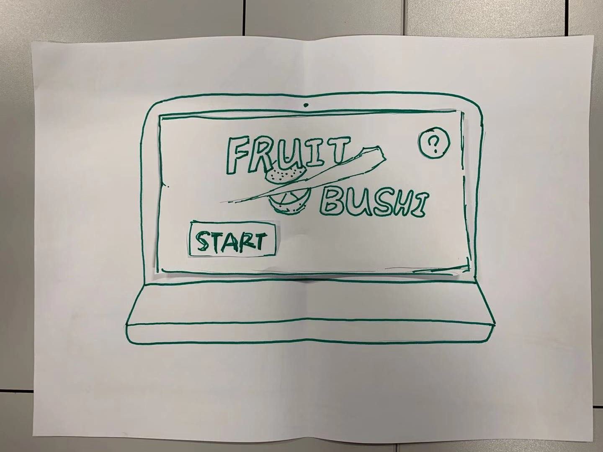

# TEAM6 -- BIG EATTER

### **Content**
 * [Introduction](#Intro)
 * [System Design](#LinkToPart1)
 * [System Implementation](#LinkToPart2)
 * [Project Evaluation](#LinkToPart3)

## Introduction
Today, there are more than 2.5 billion gamers across the world and it is calculated that they spend around 152.1 billion 
dollars on games in 2019, and the revenue of game industry is expected to be worth over 270 billion dollars by 2020. Moreover,
data analysts predict that game industry will still experience constant growth in the upcoming years.    
Coincidently, all of our group members are interested in computer games and software project gives us the chance to
implement our ideas to practice. As one of the most primary entertainment mediums with huge growth potential, we therefore
designed a multi-functional gaming BIGEATER which is aimed for gamers, game analysts and interactive players. We figured out a
new mode of gaming and hope it could be attractive for gamers and become successful in gaming industry.   
First of all, BIGEATER is a simple and small game. The reason is that with fast pace and heavy pressure, gaming is a
wonderful way to relax. Hence, we came up with the idea to design a simple and small game which do not require gamers to spend 
a lot of time to learn and do not require the subtle skills to play, neither. In addition, we believe simple games would be 
appeal to some potential gamers and therefore expand the audience.   
Secondly, BIGEATER provides processed game-related data such as game duration and game hits for game analysts, so that they 
can make decisions to optimize or promote the games. We think continuous improvement and innovation are the most significant 
factors to maintain high competitiveness of a game. Especially as a simple game, gamers may feel bored with our games easily, 
it is therefore more than important for our own game analysts to make accurate and instant decisions to perfection the flaws. 
//Also, other game analysts could use our software to know about the trend of popular games and help to improve game 
industry’s development.   
Interactive players are third user of BIGEATER. They can be regarded as companions of gamers. Before the game begins, 
interactive players can operate in the web and make a recipe for gamers. Gamers can gain bonus marks if they comb the food in 
the recipe. In the beginning, we were supposed to make a live game broadcast so that interactive can watch the game as well as
interact in the game. Unfortunately, we cannot figure out the live broadcast function and the interactive player’s role is 
limited now. Maybe it can become a good game for parents to educate children to have a good diet habit.   
  
  Kehan Du, Rao Hu, HoCheung Lee, Ben Jin, Yuxuan Qiu and Shunyi Zhao compose our team.

## System Design

In the beginning, we are supposed to design a body sensing version of FRUIT NINJA. Gamers would hold M5 stack and “knife” in 
the game would track the movement of M5 stack and cut fruits in the game.The paper prototype and processing prototype is in the folder with path ./example/example_1

Then, we found that maybe this game is improper as it is not our own idea and therefore, we brought the idea to build a   
really open game platform. Any game developers can register the accounts on our platform and are freely allowed to upload 
their games and gamers can choose any of games to play. And maybe make a combination of a live broadcast function which has become quite popular in recent years.

However, through rounds of discussion and with the problems we met in the designing process, we found that it is too 
difficult for us to realize such a platform. Hence, we went back to our original idea and designed a game BIGEATER.
There are five conveyor belts for food. The character stands at the bottom of the conveyor belt and can only move left and 
right which is controlled by M5 stack. What’s more, there would be bonus gifts showed beyond the conveyor belts randomly, 
the character can click the button on M5 stack to turn into shoot mode and would get the bonus gift if the character 
successfully shoots the subject. The game would end if the character touches the bomb.

The structure of our project is shown as below *fig.1*:

The structure of our project is shown as update *fig.2*:

## System Implementation

Because of the unforseen circumstances of COVID-19, we have to work together online. So the M5 Stack holder,
Shunyi Zhao do the works about M5 Stack and the communications between the M5 Stack and desktop application. Yuxuan Qiu, Ben 
Jin and Rao Hu completed the main functions of desktop application. Kehan Du and HoCheung Lee designed the layout of our 
website and developed the web pages. All group members are collaborators of this repository. They could push works they done 
to the dev branch of this repository directly without review of changes in file, but a pull request from dev branch to master 
branch is needed. We have an online meeting on Skype for Business every week to see what we did in the past week and make it 
clear what we are going to do in the next week. Also, our team uses a group chat on social media to keep in touch. When there 
are unsolvable problems, we would discuss in the group chat and try to figure them out as soon as possible. We work together 
quite well, everyone makes contributions and our teamwork ensures the smooth completion of this project.

### The works of IoT device, development of processing programme and development of Web are broken down to some simple problems:
 * M5 Stack GUI design
 * M5 Stack programming of IMU sensor
 * M5 Stack programming of serial and LCD
 * Processing programming of serial communication
 * Design the GUI of desktop application
 * Dssign the GUI of web application
 * Communication between desktop application and web application

### IoT Device - M5 Stack
Our IoT Device is M5 Stack.
- [Details of M5 Stack](M5_Stack/README.md)       
M5 Stack is used by gamers as a controller and we build a serial communication between M5 Stack and Processing.
API functions of IMU(Sensor MPU9250) is used to capture the accelerations and Euler Angels of M5 Stack, which is conducted 
by gamers, and use a function Serial.print() to send strings of parameters to Processing. Then, processing receives the 
incoming string data and does some space coordinate calculation to control the character or interact with the game. 
To be specific, before the game start, player can click button on the M5 Stack to choose the level of difficulty, the 
characters and themes of the game. And in the game, player can switch between left right movement mode and shoot mode. 
We choose serial communication protocol to connect M5 Stack and processing is because that it is convenient for processing 
to use Serial.print() function to receive data. In addition, serial communication responses quicker compared with MQTT and
this is important to reduce our game display delay. However, sometimes game would get stuck because of accumulation caused by 
serial communication.

### Desktop Application - Processing
- [Details of Processing](Processing/README.md)      
Desktop is where processing works.
Firstly, as mentioned above, processing receives data from M5 Stack and control the character’s movement and shooting 
behavior after some space coordinate calculation.
Secondly, processing sets rules of the game including scoring rule, random food present, and judgement of collision. 
Thirdly, processing receives information from web as interactive players would make recipe there. The recipe information is 
dealt and scoring rules is accordingly changed, which realize the interaction between interactive player and our game.
Lastly, processing sends images to web to realize game displaying
  
### Web Application
- [Details of web application](Web/README.md)     
Web is used to display the game, let interactive player make the recipe and data analysts can use it to obtain processed 
data. 
For gamers, web receives images from processing and acts as the screen for game playing. Also, it provides game information 
of background story and instructions. Gamers can also learn about some health tips for proper recipe design which equips our 
software some educational significance.

### Social and Ethnic Implication
Basically, our project is a game with interactive and data analysis functions. Due to time and knowledge limitation, we didn’t 
fulfill all the ideal functions we want. In this game, we are not only aimed at release people’s pressure and have fun, but 
also, we would like to diffuse healthy diet and help our users lead a fit life. According to World Health Organization, 39% of 
adults aged 18 years and over were over-weighted in 2016 and 38 million children under age of 5 were obese in 2019. Therefore, 
we believe our project can be educational to make some changes to this situation and game could be a better way to take effect 
compared with telling pure principles. For example, parents who can act as interactive player and children who can act as 
gamers could use our BIGEATER together to help kids form good diet habit. Also, health management organizations can implement 
our game to assist their members. What’s more, our data analysis system is open for everyone who register in our system. 
Although our analysis is simple currently, we would love to develop more advanced analysis algorithm and provide more diverse 
data. Then, the data analysis system can be more significant and we hope it could provide useful information for analysts who 
work in game industry or health management industry.
## Project Evaluation
Group memebers test the part they made by themselves separately, and the M5 Stack holder test the whole system.

### Test Methodology

---

### The disadventages of our projects are shown as below
1. The control of character ....
2. xxxx
### Future Expectation
For the future, we believe there is still a lot of improvement room for our software as we haven’t realized all the ideal 
functions we want. First of all, we would like to realize the live broadcast function so that interactive player can watch the 
game. Gaming is a traditional entertainment medium and live game broadcast is rising and becoming quite popular in recent 
years, we would like to combine them and we think that it is a new and interesting idea to let watchers interact with gamers. 
Secondly, we want to build a game platform which allows game developers to upload their won games. Continuous innovation is a 
key factor in gaming industry, especially for simple and small games where gamers may fell bored easily. Therefore, we would 
love to provide an open platform for all game developers to show their talents.
