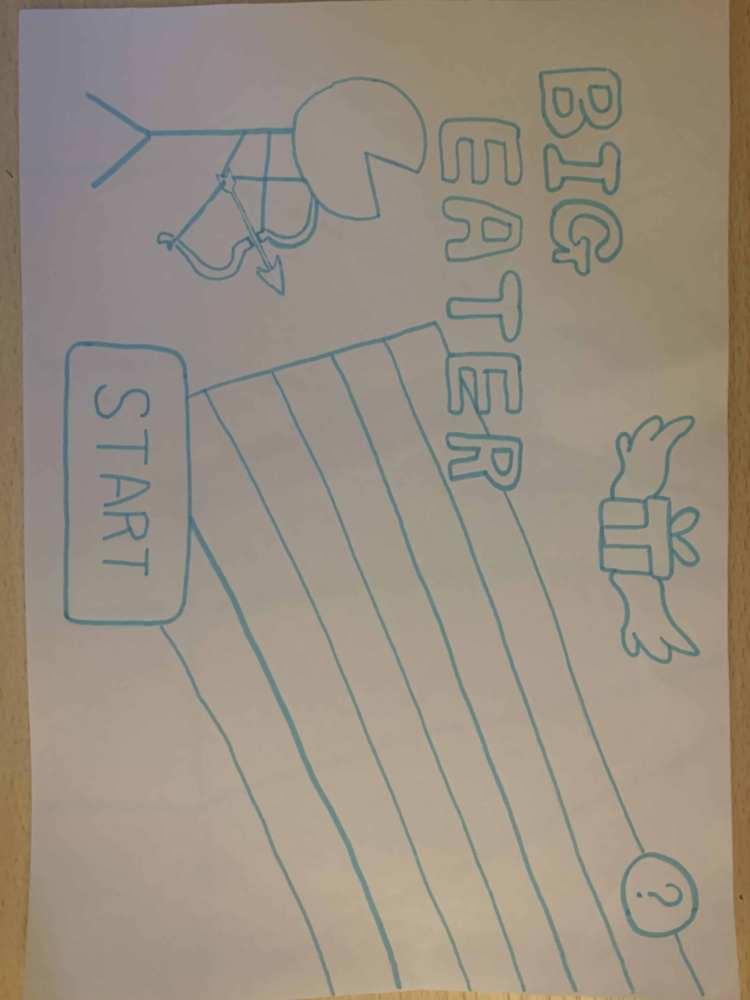
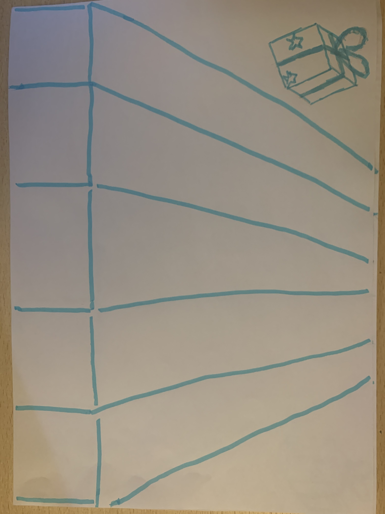

# Paper Prototype and Processing Prototype -- Version 2

Then we change the structre of our game. A character would move from left to right at
the bottom of the screen. This character could switch the state, get the food via touching
food or with a hook.

The paper prototype of this version is shown below.

The main GUI of version 2 of our game:

The game interface of version 2:

The game interface of version 2:

When the character crash the food, gain scores:
